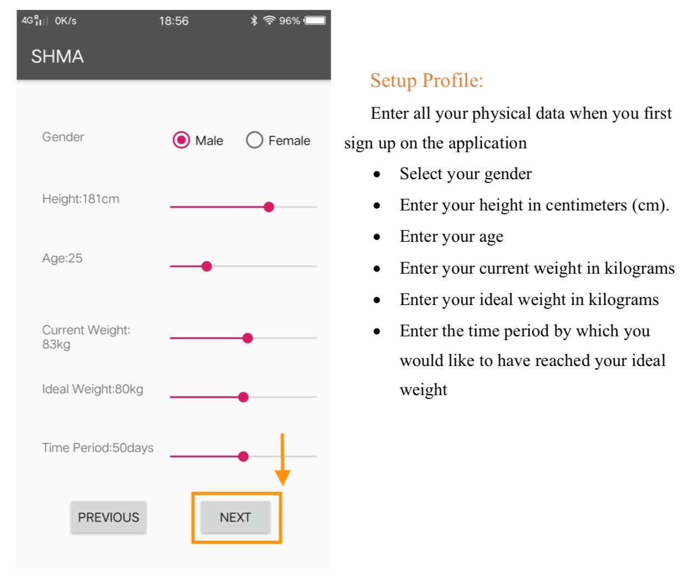
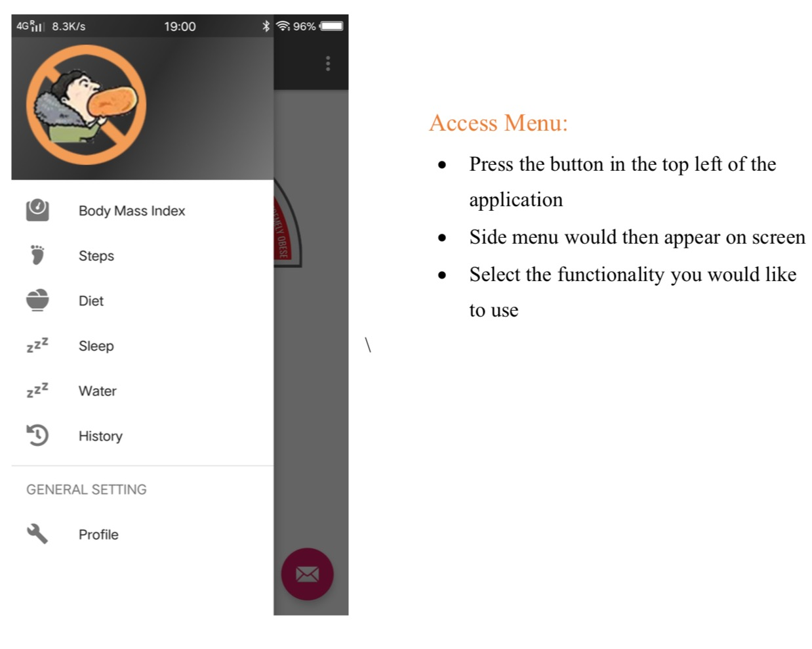
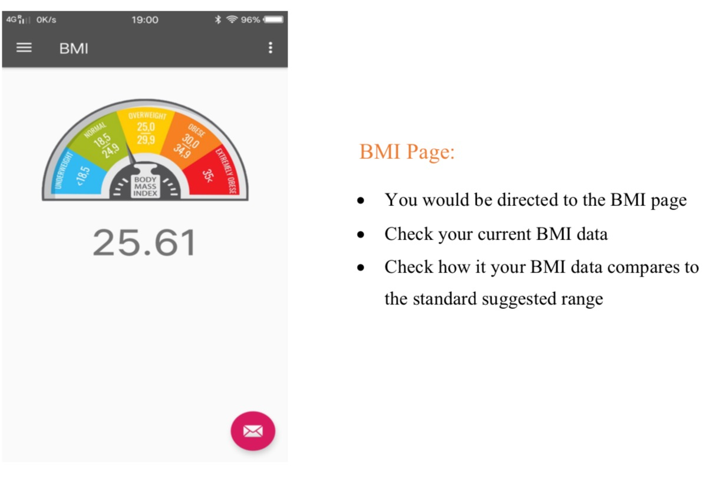
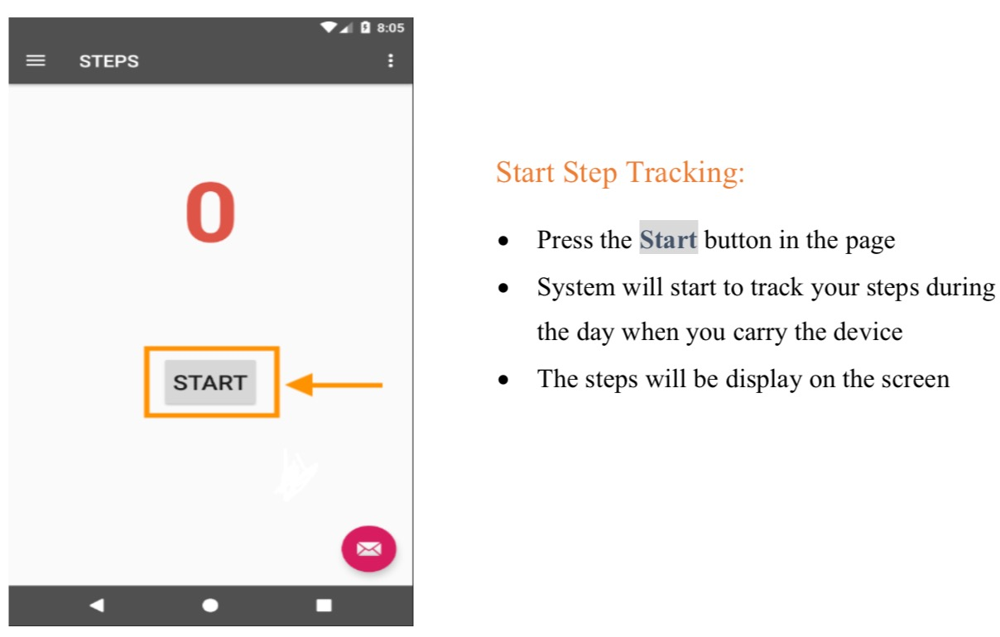
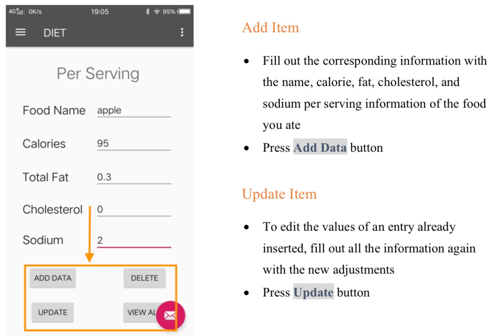
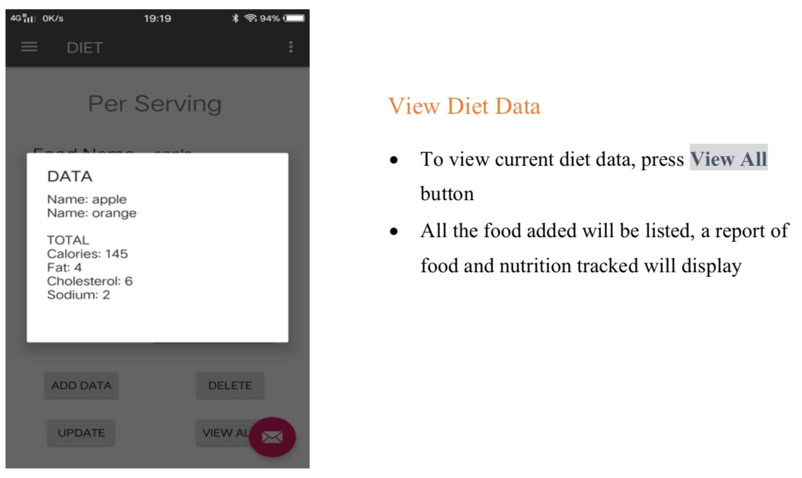
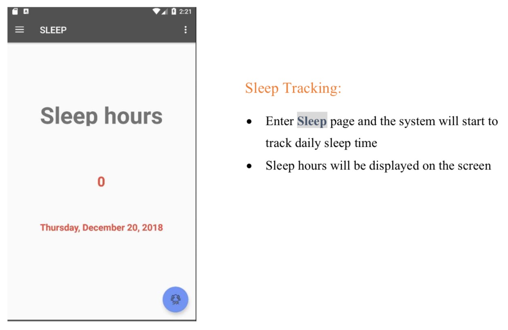
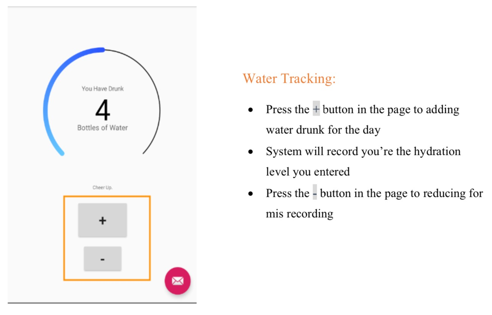

# HealthMonitorApp

### Abstract 
This is a HealthMonitorApplication built by android. We fulfill the functions which are BMI calculation and display, step counter on background, food database and calorie calculation, sleep hours monitor, water volume record. And this application also support personal information setting, modification and exercise goal setting.

### How to use
people can download the HealthMonitorApp.apk in final_apk documents. Majority of android devices can be used. Android 7.0 and upper version are preferred.

### Sign up and Sign in 

### Personal profile

### Navigate bar

### BMI 

### Step counter

### Food database

### Sleep hours

### Water record

### Contact information

The application still need to modify and fulfill the history function, if you have any advice please contact Yulei.Wang@tufts.edu.......

